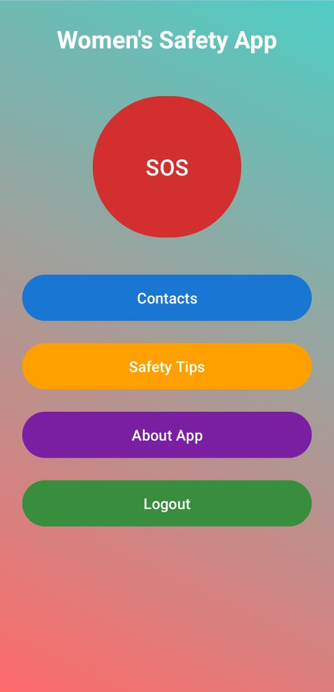
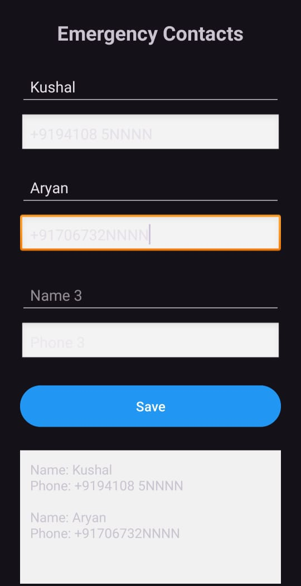
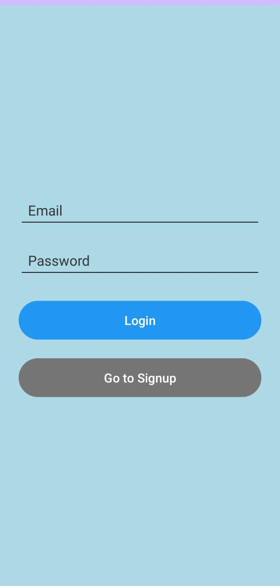
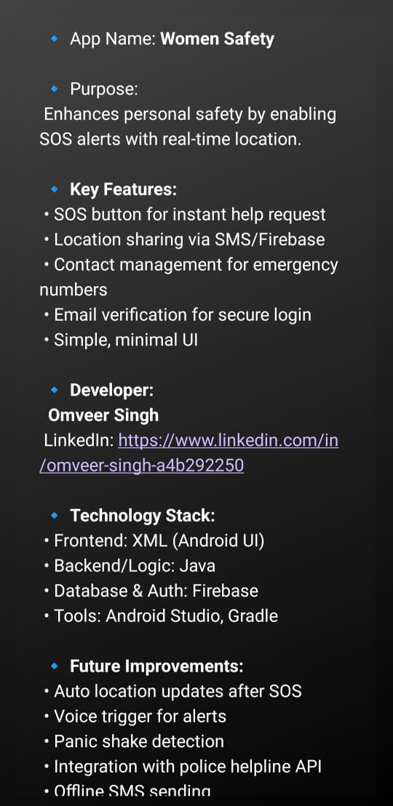
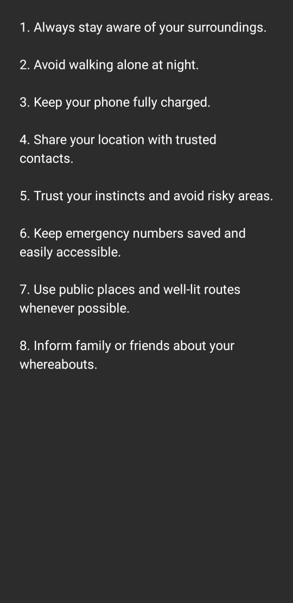
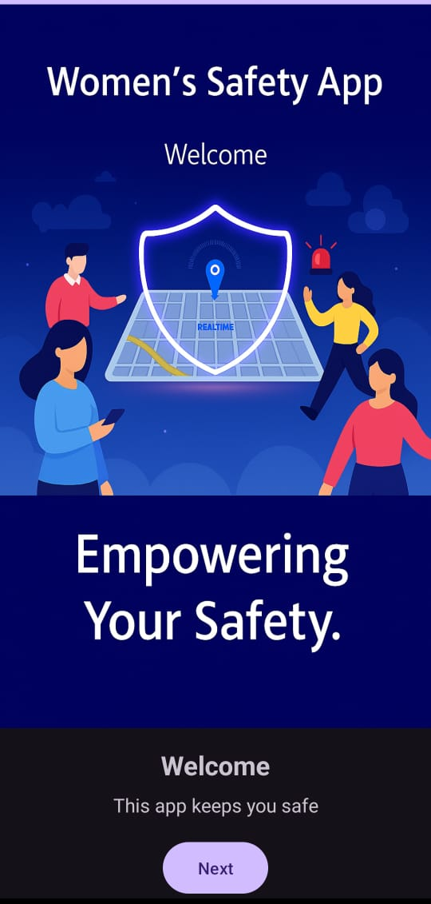
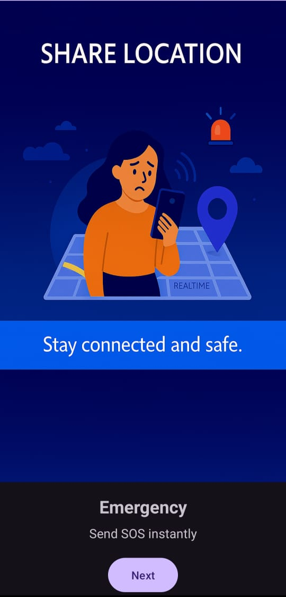
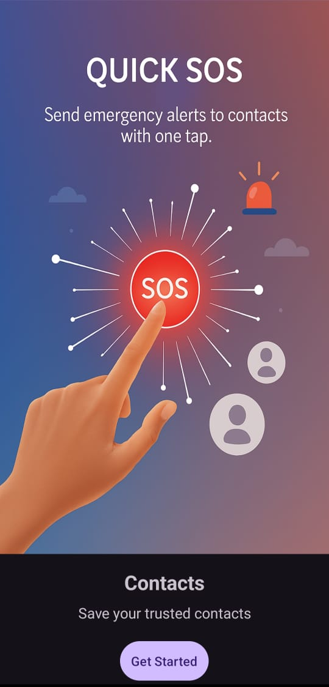

# 🛡️ Women Safety App  

<p align="center">
    
</p>

<p align="center">
  
  
  
  
</p>
A mobile application built to enhance women’s safety by providing quick access to emergency contacts, safety tips, and SOS features.  
This project is developed in **Android Studio (Java + XML)** with **Firebase Authentication & Realtime Database** for secure data management, and packaged as an APK for installation.  

---

## 📱 Features
- 🚨 **SOS Button** → Instantly send an emergency message to saved contacts.  
- 📞 **Emergency Contacts** → Add and manage trusted contacts.  
- 🔐 **Login System** → Secure authentication using Firebase before accessing features.  
- 📖 **Safety Tips** → Quick guidelines for staying safe.  
- 🎨 **Simple UI** → Easy to use with minimal design.  

---

## 📥 Installation

Download the latest APK from here:  
👉 [**WomenSafetybyOm.apk**](assets/WomenSafetybyOm.apk)

Then install it on your Android device (you may need to enable *Install from Unknown Sources* in your phone settings).

---

## 📸 Screenshots

| Home | Contacts | Login |
|------|----------|-------|
|  |  |  |

| About App | Safety Tips | Welcome |
|-----------|-------------|---------|
|  |  |  |

| Welcome 2 | Welcome 3 |
|-----------|-----------|
|  |  |

---

## 🛠️ Tech Stack
- **Java** (Android)  
- **XML** (UI Design)  
- **Firebase** (Authentication & Realtime Database)  

---

## 🚀 How to Run
1. Clone this repository  
   ```bash
   git clone https://github.com/OmveerSingh01/WomenSafety.git


2. Open the project in Android Studio

3. Connect to Firebase (Authentication + Realtime Database)

4. Build & Run on an Android Emulator or Physical Device

## ✨ Future Improvements

🔔 Real-time location sharing with trusted contacts

📡 Integration with Google Maps for SOS tracking

🔊 Voice-activated SOS trigger

📲 Push notifications using Firebase Cloud Messaging (FCM)


## 👨‍💻 Developer  

**Omveer Singh**  
📧 [Email Me](mailto:osrathore98@gmail.com)  
🔗 [LinkedIn](https://www.linkedin.com/in/omveersingh09)  
